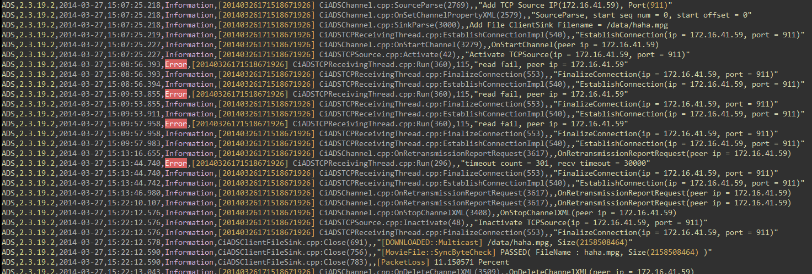

# vim-syntax-cilog

vim syntax highlight script for CiLog(*.log) files.

##Installation

To install, simply:

```
$ ./install.sh
```

## Features

- Highlight columns
- Highlight Error, Fail, Warning level keywords
- Highlight values in brackets.

##Screenshot


